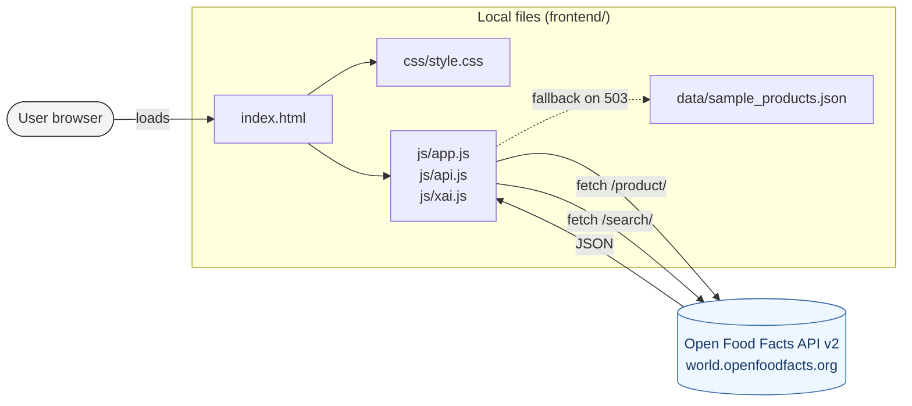

# Architecture — FoodLens MVP

> Snapshot of the technical decisions for the current iteration. Updated by feature owners when their feature changes documented behaviour.

## TL;DR

**Dual-mode**: frontend-only (default) and frontend + Flask backend (opt-in).

- **Frontend-only mode** (default): browser → Open Food Facts public API → browser. ES module JavaScript, hand-written CSS, no build step. Works with `python3 -m http.server` or any static host.
- **Frontend + backend mode** (opt-in): uncomment the `<meta name="foodlens-backend-url">` tag in `index.html`. Alternatives are served from the Flask KNN endpoint; the in-browser JS KNN path remains the fallback if the backend is unreachable.

Backend (Python + Flask + scikit-learn) was introduced in SDD change `backend-flask-mvp` on 2026-05-13, implementing F-23 (Flask skeleton + KNN endpoint) and F-25 (Docker + explainer + frontend integration).

## Current architecture (frontend + backend mode)

```mermaid
flowchart LR
    User([User browser]):::user
    subgraph Frontend["frontend (nginx:alpine OR python -m http.server)"]
        HTML[index.html + js/* + css/*]
        Sample[data/sample_products.json]
    end
    subgraph Backend["backend (python:3.11-slim, Flask)"]
        App[app.py routes]
        OFFC[services/off_client.py<br/>TTLCache + TokenBucket]
        Rec[services/recommender.py]
        Idx[services/index_store.py<br/>alt_index.pkl in memory]
        Exp[services/explainer.py]
        Norm[services/normaliser.py]
    end
    OFF[(Open Food Facts API v2<br/>world.openfoodfacts.org)]:::ext

    User -->|loads| HTML
    HTML -->|fetch /product/, /search/| OFF
    HTML -. ->|optional fetch /api/alternatives, /api/explain<br/>only if BACKEND_URL set| App
    HTML -. ->|JS KNN fallback if backend 4xx/5xx/timeout| Sample

    App --> Rec
    App --> Exp
    Rec --> Idx
    Exp --> Idx
    App --> OFFC
    OFFC --> Norm
    OFFC -->|cached or live| OFF
    OFFC -. ->|OFF 503 with index hit| Idx
    Idx -. ->|alt_index.pkl loaded at boot<br/>built offline by scripts/build_knn_index.py| Idx

    classDef user fill:#f4f4f4,stroke:#333,color:#333
    classDef ext fill:#eef6ff,stroke:#3366aa,color:#1a3a66
```

Fallback edges (dotted): (a) frontend → JS KNN when backend unreachable; (b) backend OFF client → in-memory index when OFF /product returns 503 and the barcode is in the prebuilt index; otherwise propagates the error.

## Frontend-only mode (still the default)



Three properties make this work:

1. **Open Food Facts has CORS open** (`access-control-allow-origin: *`, confirmed with `curl -I OPTIONS`). The browser calls the API directly.
2. **Static files only**. `python3 -m http.server` or any static host serves the app. No runtime dependency.
3. **Resilience by fallback**. When `/search` returns 503 (it does, intermittently), the app degrades to a curated `sample_products.json` instead of breaking.

## Architecture that we deliberately did NOT build for the base

For documentation honesty: the team considered and rejected the following for the base.

| Considered | Rejected because | Reintroduced as |
|---|---|---|
| Flask + flask-cors backend proxying OFF | Adds setup cost that blocks teammates from running the project locally | **Now in scope** — F-23 implemented 2026-05-13 |
| Docker + docker-compose | Same — each member would need to learn Docker before touching HTML | **Now in scope** — F-25 implemented 2026-05-13 |
| PHP + Apache static server | Overkill (~430MB image) to serve three HTML files | Discarded outright |
| Nginx reverse proxy | Single-origin CORS is solved already; reverse proxy is a production concern, not a prototype one | Deferred to WA5 if deployed |
| Streamlit / Plotly Dash | The brief suggests them; they would block customisation needed by hooks H2 and H3 | Not planned |
| SHAP server-side | Required only by Pau (the analyst persona); 80% of users need the contrastive sentence, not the waterfall | F-24 (Pau-targeted "Advanced" toggle) |

### Now in scope (as of F-23 / F-25 implementation — 2026-05-13)

**Flask backend** (`backend/`):
- `app.py` — app factory, 5 routes: `GET /`, `GET /health`, `GET /api/search`, `GET /api/product/<barcode>`, `GET /api/alternatives/<barcode>`, `GET /api/explain/<barcode>`.
- `services/off_client.py` — OFF HTTP client with TTL cache + token-bucket rate limiting.
- `services/recommender.py` — KNN over preloaded `alt_index.pkl`; strict-better filter (spec R-KNN-3).
- `services/explainer.py` — Python port of `js/xai.js`; contrastive sentence stub (replaced by SHAP in F-24).
- `services/index_store.py` — in-memory index loader; scaler applied manually (design D5).
- `scripts/build_knn_index.py` — offline builder; run before starting the server.

**Docker** (`docker-compose.yml`):
- `backend` service: `python:3.11-slim`, port 5000, `backend/data` mounted read-only.
- `frontend` service: `nginx:alpine`, port 8080, SPA routing + cache headers.
- `docker compose up --build` brings both services up with healthchecks.

**Frontend integration** (opt-in):
- Uncomment `<meta name="foodlens-backend-url" content="http://localhost:5000">` in `index.html`.
- `api.js` reads the tag and exports `getAlternativesFromBackend()` (1.5s timeout, never throws).
- `app.js` tries backend first; falls back to JS KNN on any failure.

## Data flow — typical request lifecycle

```mermaid
sequenceDiagram
    actor User
    participant UI as Browser UI (app.js)
    participant API as api.js
    participant OFF as Open Food Facts
    participant XAI as xai.js
    participant Card as Product card view

    User->>UI: Submits search query "yogurt"
    UI->>API: searchProducts("yogurt")
    API->>OFF: GET /search?categories_tags=...
    alt OFF responds 200
        OFF-->>API: { products: [...] }
        API-->>UI: normalised products[]
    else OFF responds 503
        API->>API: load sample_products.json
        API-->>UI: normalised products[] (from sample)
    end
    UI->>XAI: generateContrastiveSentence(p, reference)
    XAI-->>UI: "Has 30% less sugar than X per 100g, ..."
    UI->>Card: render(product, sentence, alternatives)
    Card-->>User: Visible dual-axis card with reasoning
```

## OFF data model — what we use and how

We do not store any of this — we only consume it at request time. Reference fields, mapped to UI concerns:

| OFF field | Type | Used by | Notes |
|---|---|---|---|
| `code` | string | F-04, F-21 | Barcode (EAN-13 normally) — primary key |
| `product_name` | string | F-05+ | Display name. May be `null` for poorly catalogued products. |
| `brands` | string (CSV) | F-05+ | Comma-separated brand list. Split on `,` for chips. |
| `image_front_url` | URL | F-05+ | Often `null`. Use a placeholder image when missing. |
| `categories_tags` | string[] | F-14, F-15 | Hierarchical tags `["en:beverages", "en:colas"]`. We pick the most specific for KNN context. |
| `nutriscore_grade` | enum | F-05 | `a|b|c|d|e|unknown|not-applicable`. Render badge for all six states. |
| `environmental_score_grade` | enum | F-06 | Same enum. **Read this first.** |
| `ecoscore_grade` | enum | F-06 (legacy) | Fallback when `environmental_score_grade` is `null`. The schema is mid-migration. |
| `nutrient_levels` | object | F-08, F-09 | `{fat, salt, saturated-fat, sugars}` each `low|moderate|high`. Pre-computed by OFF. Gold for XAI without ML. |
| `nutriments` | object | F-09 (drill-down), F-15 | Numeric `*_100g` fields. Used as features for KNN. |

### Normalised product shape (the one the UI sees)

`api.js` returns this shape regardless of source (live API or sample fallback):

```ts
{
  source: 'api' | 'sample',
  code: string,
  name: string | null,
  brands: string[],          // split from comma-separated
  image: string | null,
  category: string | null,    // most specific tag from categories_tags
  nutriScore: {
    grade: 'a' | 'b' | 'c' | 'd' | 'e' | 'unknown' | 'not-applicable',
    numeric: number | null,   // 5 for a, 1 for e, null for unknown/not-applicable
  },
  ecoScore: {
    grade: 'a' | 'b' | 'c' | 'd' | 'e' | 'unknown' | 'not-applicable',
    numeric: number | null,
    sourceField: 'environmental_score_grade' | 'ecoscore_grade'
  },
  nutrientLevels: {
    fat: 'low' | 'moderate' | 'high' | null,
    salt: 'low' | 'moderate' | 'high' | null,
    saturatedFat: 'low' | 'moderate' | 'high' | null,
    sugars: 'low' | 'moderate' | 'high' | null
  },
  nutrients: {
    energyKcal_100g: number | null,
    fat_100g: number | null,
    saturatedFat_100g: number | null,
    sugars_100g: number | null,
    salt_100g: number | null,
    fiber_100g: number | null,
    proteins_100g: number | null
  }
}
```

This shape is the contract between `api.js` and everything that consumes products. If you change it, every feature breaks — coordinate with the team.

## How the WA3 hooks map onto code modules

| Hook | Module(s) responsible |
|---|---|
| H1 Dual-axis default | `js/components/product-card.js` (renders both badges) |
| H2 Reasoning IS the recommendation | `js/components/product-card.js` + `js/xai.js` |
| H3 One sentence, one number | `js/xai.js` (template enforcement) |
| H4 Configurable first axis | `js/components/weighting-slider.js` |
| H5 Compare-this-shelf | `js/views/compare.js` |
| H6 Minimal onboarding | `js/views/onboarding.js` + `localStorage` key `foodlens.profile` |
| H7 Close into action | `js/components/product-card.js` (action button row) |

The module layout is suggested, not prescriptive. Feature owners may reorganise as needed, as long as the hook is still satisfied by some module.

## Limitations of the MVP (acknowledged)

These will appear in the WA4 paper's *Limitations* section. Owners should document them in their feature PRs.

1. **No persistent user accounts.** Profile lives in `localStorage` only. Clearing browser data wipes it.
2. **No offline cache beyond `sample_products.json`.** Real offline use would need a Service Worker (out of scope).
3. **KNN runs in the browser over ~50 products max.** Above that, performance degrades. F-23 introduces a backend KNN over the full OFF catalogue.
4. **`environmental_score_grade` is often missing for non-EU products.** We render `"not-applicable"` instead of trying to compute it from `nutriments` (we would not have the methodology data).
5. **Nutri-Score is consumed, not computed.** We never recalculate it locally because the official algorithm has per-category rules we would not faithfully reproduce.
6. **Locale.** UI strings are English-only for the base. Spanish/Catalan localisation is a follow-up if the team has bandwidth.
7. **Barcode scanning is desktop-webcam only.** No mobile-native scanning (deferred per WA3 scope guard).

## Performance expectations

- Cold load: under 500ms (only HTML + CSS + ~3 small JS files).
- OFF `/product/` round-trip: ~200–600ms from the EU.
- KNN over 50 products in the browser: under 100ms.
- Fallback to `sample_products.json`: under 50ms.

If any of these regress, file a bug.

## How this architecture maps to the WA4 paper sections

For paper writers (mainly P1, Alejandro Bordón):

- *System Architecture*: this document, summarised.
- *Implementation*: the realised features from the backlog.
- *Limitations*: the section above.
- *Future Work*: features F-23, F-24, and "Out of scope for WA4" from `feature-backlog.md`.
- *Evaluation* (WA5): driven by the user flows in `user-flows.md` plus SUS + Explanation Satisfaction Scale instruments.
