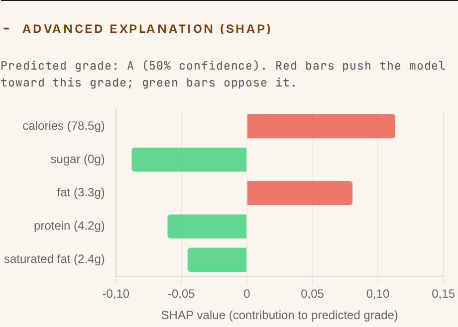
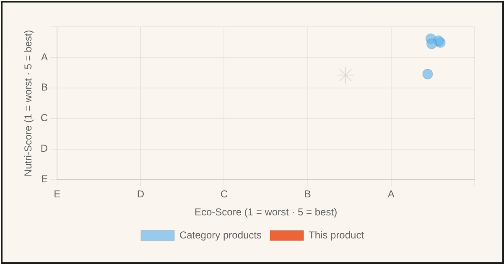
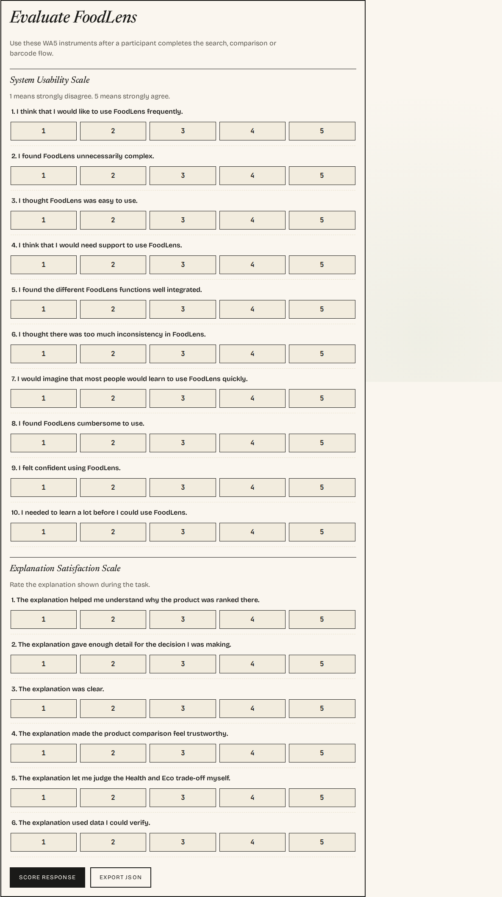
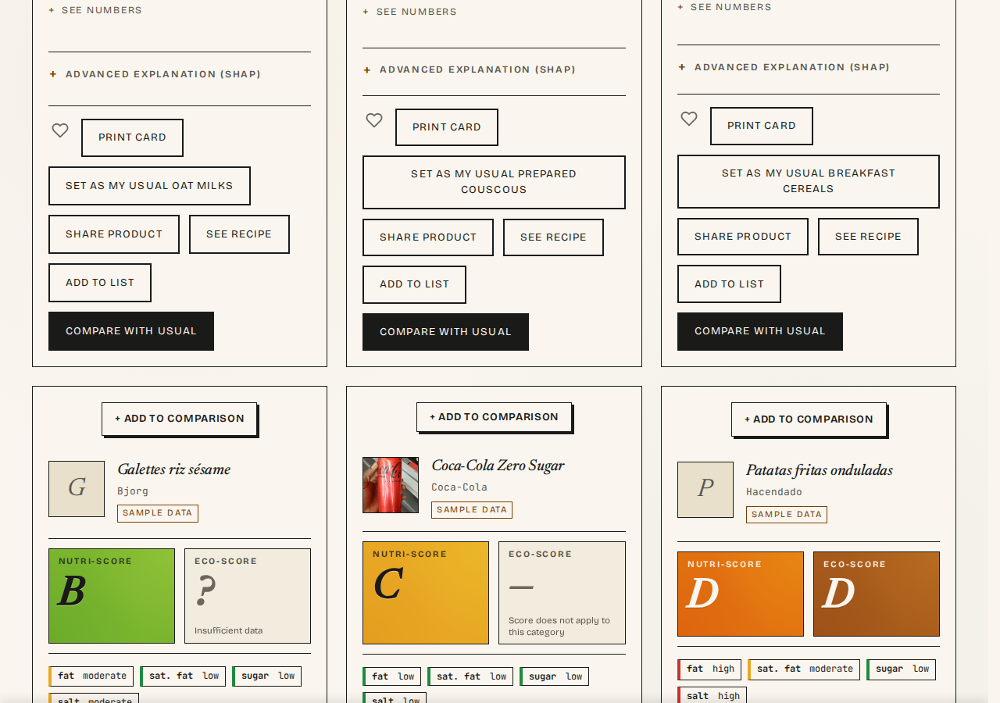
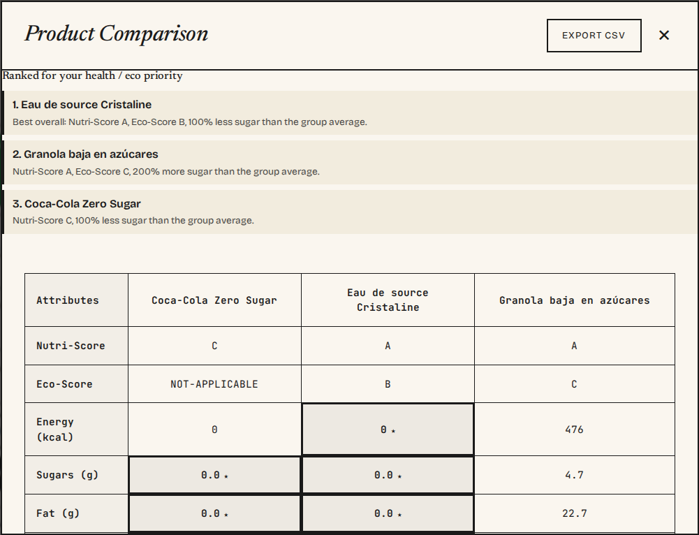

## FoodLens

**Transparent multi-objective food recommendations via contrastive XAI**

Health (Nutri-Score) and Eco (Environmental Score) — shown together, never averaged, always explained with one verifiable number.

Team: Alejandro Bordón · Soufyane Youbi · Alejandro Rodríguez · Pau Girón

Course 11755 — Human-Computer Interaction · MUSI-IA, UIB · June 2026

::: notes
**Alejandro Bordón:** Good morning. We are team FoodLens, and this is the final deliverable for the HCI course. The one-line version: most food apps give you a single score and ask you to trust it. We give you two axes — how healthy a product is, and how heavy its environmental footprint is — we never hide the tension between them, and we explain every recommendation with a single sentence anchored on a real number from Open Food Facts. Over the next twenty-five minutes the four of us will walk you through how we got here, the AI behind it, our evaluation plan, the hard problems we hit, a live demo of the working platform, and what we learned. Let me start with the design process.
:::

## Outline

1. **Design process & rationale**
2. **XAI methods selection**
3. **Key insights from user testing**
4. **Technical & design challenges**
5. **Live demonstration of the dashboard**
6. **Lessons learned & future improvements**

All four of us present; roughly eight minutes of the talk is a live demo of the working web platform, right before the conclusions.

::: notes
**Alejandro Bordón:** Here is the map. Six points, all mandated by the rubric. I take the design process and, at the end, the lessons and future work. Sufi covers the explainable-AI methods and why we chose them. Alejandro Rodríguez presents our user-testing protocol and later drives the live demo. Pau covers the technical and design challenges. We deliberately put the live demonstration near the end, right before the conclusions, so by the time you see it working you already know what every part means. Let's begin with the design process.
:::

# 1. Design process & rationale

## WA3 discovery: research before code

We ran **six semi-structured interviews** with people who make real grocery decisions — from a 20-year-old student to a 41-year-old designer on a quasi-vegetarian diet.

- Protocol kept **context exploration separate from XAI concepts** to avoid leading questions
- Thematic analysis (Braun & Clarke): **47 codes -> 5 Key Insights**
- The asymmetry we found: **health is a label you read in passing; ecology is buried in a database** — and the conflicts between them are surfaced nowhere

Every feature we shipped traces back to one of those insights. Nothing was designed by intuition alone.

::: notes
**Alejandro Bordón:** We did not start by coding. We started by listening. Six semi-structured interviews with people who actually do the weekly shop, ranging from a twenty-year-old who barely cooks to a forty-one-year-old managing a near-vegetarian diet. We deliberately kept the contextual questions away from any AI talk so we would not lead them. Then we ran a thematic analysis — forty-seven initial codes collapsing into five Key Insights. The core problem we surfaced is an asymmetry: Nutri-Score is on the front of the pack, the Eco-Score basically never is, and nobody shows you when the two disagree. That asymmetry is the whole reason FoodLens exists.
:::

## The five Key Insights

- **KI-1 — Visible reasoning is a prerequisite for trust.** An opaque score reads as marketing. Never hide the "why".
- **KI-2 — The value-action gap is contextual.** Time, budget, fatigue override good intentions. Never moralise.
- **KI-3 — Single-axis labels create axis blindness.** A soda outscoring juice; water-hungry almonds looking "healthy".
- **KI-4 — Contrastive framing turns explanations into decisions.** "30% less sugar than yours" beats "70/100".
- **KI-5 — Tolerance for configuration varies widely.** Sensible default, presets, advanced slider behind progressive disclosure.

::: notes
**Alejandro Bordón:** These five insights are our north star. KI-1: people don't reject algorithms on principle, they reject ones whose reasoning is hidden — so we must always show the why. KI-2: the gap between what people want and what they buy is situational, driven by time and budget, so we never lecture. KI-3: single labels create false confidence — participants gave us real examples, a soda beating juice on Nutri-Score, almonds looking healthy while being ecologically expensive. KI-4: people reached for contrastive language on their own — a delta is processed faster than an absolute grade. And KI-5: everyone wanted to tune health-versus-eco, but their appetite for setup ranged from one button to a full slider panel.
:::

## From insights to seven Design Hooks

| Hook | Rule it enforces |
|---|---|
| **H1** | Dual-axis default — eco badge never hidden, even "no data" renders with a caption |
| **H2** | Reasoning IS the recommendation — contrastive sentence open by default |
| **H3** | One sentence, one number — charts are drill-downs, not the entry point |
| **H4** | Configurable first axis — health/eco slider; price behind "Advanced" |
| **H5** | Compare-this-shelf — N products in, ranked list out, one-line justification each |
| **H6** | Minimal onboarding — goals + age + gender only |
| **H7** | Close into action — every card ends in a real next step |

::: notes
**Alejandro Bordón:** We translated those insights into seven concrete, testable Design Hooks — hard constraints on the interface. H1: both axes always visible, and even when Open Food Facts has no eco grade, the badge still renders with a "no data" caption instead of disappearing. H2: the explanation is not on a separate screen, it's open by default on the card. H3: one sentence, one number — charts are a drill-down, never the front door. H4: the slider is health-versus-eco, price hidden behind Advanced. H5: comparison takes N products in and returns a ranked list. H6: onboarding asks the minimum. H7: every card ends in an action. These hooks are what we test the build against.
:::

## Personas: who we are designing for

::: columns
:::: {.column width="50%"}
- **Marc Vidal** — time-strapped pragmatist. Shops on autopilot, will not configure. Wants instantly visible reasoning.
- **Pau Estarellas** — sceptical analyst. Distrusts opaque scores. Needs verifiable numbers and the drill-down.
::::
:::: {.column width="50%"}
- **Lluís Tomàs** — autonomous planner. Hates greenwashing and moralising. Wants quick visual graphs, opt-in only.
- **Aina Servera** — convenience seeker. Time- and budget-bound. Hard boundary against guilt-inducing UX.
::::
:::

Four personas, four constraints. If a decision helps one and hurts another, we name the trade-off.

::: notes
**Alejandro Bordón:** We synthesised the interviews into four personas, each carrying a constraint. Marc shops on autopilot — he proves the system has to work with zero configuration. Pau Estarellas distrusts any score he can't check — he's why the drill-down exists. Lluís despises greenwashing and moralising — he demands an opt-in, on-demand tool. And Aina is so time- and budget-pressed that any app lecturing her loses instantly — she's our hard boundary against judgmental copy. When two personas pull in opposite directions, we surface the trade-off rather than quietly picking a side. With that foundation set, I'll hand over to Sufi for the AI layer.
:::

# 2. XAI methods selection

## Why these methods: Miller's criteria

Tim Miller (2019): good explanations are **contrastive, selective, and grounded in the user's mental model** — not raw scores.

We chose each XAI component to satisfy a specific criterion:

- **Contrastive** -> "why this and not your usual?" — the contrastive sentence generator
- **Selective** -> one number, not twenty — H3 discipline over rich model output
- **Grounded / auditable** -> an interpretable model plus a verifiable drill-down for the sceptic

The literature gave us the test; our job was to make a vanilla-JS app pass it.

::: notes
**Soufyane Youbi:** Thanks Alejandro. Our XAI choices are not arbitrary — they come straight out of the social-science account of explanation. Tim Miller's key finding is that good explanations are contrastive, they're selective, and they're grounded in what the person already understands. A raw model score fails all three. So we mapped each of our techniques to one of those properties. Contrastive: we answer "why this product, not the one you usually buy". Selective: we surface one number, not the full feature vector — that's our H3 discipline. Grounded and auditable: we use an interpretable model and we give the sceptic a way to check the math. The literature handed us the rubric; we engineered the app to pass it.
:::

## An interpretable model: Random Forest for Nutri-Score

- The system reads the **official `nutriscore_grade`** — we never recompute the certified label locally.
- For the XAI pipeline we trained a **Random Forest** on a real OFF dump (~80% five-fold CV accuracy).
- Why a forest, not a deep net: **feature importances are first-class** — fat, sugars, saturated fat, salt, protein, fibre, energy each carry a readable weight.
- This is a **pipeline-verification model**: it proves the explanation path end-to-end, it does not replace the official grade.

::: notes
**Soufyane Youbi:** First, the model. We deliberately do not recompute the Nutri-Score ourselves — the official algorithm has category nuances and we read the certified `nutriscore_grade` straight from the API. But for the explanation pipeline we trained a Random Forest on a real Open Food Facts dump, reaching about eighty percent five-fold cross-validation accuracy. Why a forest and not a neural net? Because feature importances come for free and they're readable — each of the seven per-hundred-gram nutrients carries an interpretable weight. I want to be honest about scope: this is a pipeline-verification model. It proves the explanation path works end-to-end; it is not pretending to replace the official grade.
:::

## SHAP -> one contrastive sentence, one number

{width=78%}

- **SHAP local attribution** computes each nutrient's contribution for *this* product
- We compress that vector into **one contrastive sentence with exactly one verifiable number** (H3)
- The full SHAP detail is parked behind an **"Advanced explanation"** — selective by default, complete on demand

::: notes
**Soufyane Youbi:** This is where Miller meets the screen. SHAP gives us local feature attribution — for this specific product, how much did sugar push the grade down, how much did fibre push it up. That's a vector. But a vector violates the selective principle and overloads the shopper. So we collapse it into a single contrastive sentence with exactly one number — that's Design Hook H3 in action. The full SHAP breakdown isn't thrown away; it's parked behind an "Advanced explanation" toggle, which is the waterfall you see here. Selective by default for Marc, complete on demand for anyone who wants the detail.
:::

## The scatter drill-down: for the sceptic who verifies

{width=64%}

- The contrastive sentence answers Marc in half a second; **Pau Estarellas wants to see the space.**
- `GET /api/scatter` returns a **visual XAI scatter plot**: where this product sits on the health/eco plane relative to its category.
- The drill-down is **opt-in** — Miller's selectivity, and Lluís's "no moralising, just show me the graph".

**How each method helps the user:** sentence = instant trust; SHAP advanced view = traceability; scatter = independent verification.

::: notes
**Soufyane Youbi:** One sentence is enough for the time-poor pragmatist. It is not enough for the sceptical analyst. Pau Estarellas told us in discovery that he won't trust a grade he can't check. So the drill-down is this scatter plot, served from our scatter endpoint, that places the product on the health-versus-eco plane against the rest of its category — he can see with his own eyes whether the recommendation is defensible. Crucially it's opt-in: it only appears when he asks, which also satisfies Lluís, who wanted graphs over guilt. Three layers, three personas: the sentence gives Marc instant trust, the advanced SHAP view gives traceability, and the scatter gives Pau independent verification. Before I hand over, one slide on all the AI we used.
:::

## The AI we used — in the product and in development

::: columns
:::: {.column width="52%"}
**In the product (ML / XAI)**

- **Random Forest** (scikit-learn) — predicts Nutri-Score for the explanation pipeline
- **SHAP** — local feature attribution -> the one contrastive sentence
- **Weighted KNN** — the Alternative Engine (healthier / greener substitutes)
- **DuckDB** — queries the full OFF dump at scale
::::
:::: {.column width="44%"}
**In development (generative AI)**

- **LLM coding assistants** to speed up boilerplate, tests, and docs
- **Human-verified**: every change reviewed, adversarially audited (this caught the dead allergen filter), and gated by tests
- We **direct** the AI — the design and the verification are ours
::::
:::

We disclose both: the AI *inside* FoodLens, and the AI we used to *build* it.

::: notes
**Soufyane Youbi:** One honest slide before I hand over, because we think you should declare both kinds of AI. Inside the product: a scikit-learn Random Forest drives the Nutri-Score explanation pipeline, SHAP gives the local attribution we compress into one sentence, a weighted KNN powers the Alternative Engine, and DuckDB lets us query the full Open Food Facts dump at scale. And in development: we used LLM coding assistants to speed up boilerplate, tests, and documentation — but every change was human-reviewed, adversarially audited (that is literally how we caught the dead allergen filter), and gated by tests. We direct the AI; the design decisions and the verification are ours. With that declared, Alejandro will take you through how we evaluate all of this with users.
:::

# 3. Key insights from user testing

## Two instruments, built in-app (F-46)

{width=46%}

- **SUS** (Brooke 1996) — 10 items, usability of the dashboard (KI-2)
- **Explanation Satisfaction** — anchored to **XEQ** (Wijekoon 2024): clarity, consistency, on-demand detail, reliability/fairness, improved understanding (KI-1, KI-4)
- Both **wired into the prototype** — completed in the same browser session, no external survey tool

::: notes
**Alejandro Rodríguez:** Evaluation. We measure two different things and we keep them apart on purpose, so a friendly usability score can't mask a weak explanation layer. The first is the System Usability Scale — Brooke, 1996 — ten items, measuring whether the dashboard is navigable. The second is explanation satisfaction, anchored to the XEQ construct from Wijekoon and colleagues, 2024: clarity, consistency, on-demand detail, perceived reliability and fairness, and improved understanding. Both instruments are not a Google Form — they are feature F-46, built into the app, so a participant finishes the tasks and fills them in the same browser, same session, no context switch.
:::

## Procedure & cohort

- **Six task scenarios** mapped to documented user flows: onboarding+search · read explanation · find alternative · compare shelf · set "my usual" · drag slider
- **SEQ** after each task for per-flow diagnostics; SUS once at the end
- **Cohort:** the six WA3 interviewees re-used (Nielsen formative, n=6). P01 & P03 are team members — declared bias, weighted as optimistic
- Scoring **pre-registered**: odd items raw minus 1, even items 5 minus raw, then x2.5 to 0-100; benchmark **68**, Sauro–Lewis grade bands

::: notes
**Alejandro Rodríguez:** The procedure: six tasks that follow our documented user flows in order — onboarding and search first because it gates everything, then reading an explanation, finding an alternative, comparing a shelf, setting a usual product, and dragging the slider. After each task there's a Single Ease Question so we can localise friction to a specific flow; SUS is administered once at the very end. The cohort is the same six people we interviewed in WA3 — that's a Nielsen-style formative study at n equals six, not a powered experiment. Two of the six are team members; we declare that bias openly and weight their data as optimistic. And the scoring is pre-registered: the standard SUS formula, the benchmark of sixty-eight, and the Sauro-Lewis grade bands, all committed before any data exists.
:::

## Honest status: instrument built, data pending

- The instrument is **built, wired, and ready**. The task suite and cohort are defined.
- **No participant data has been collected yet.** We will **not** quote a SUS score we did not measure.
- Pre-committing the scoring rules and thresholds **before** collection is sound method — it removes the temptation to fit interpretation to whatever numbers arrive.
- **Pre-registered hypotheses:** (H-a) contrastive + drill-down raises satisfaction for the sceptic; (H-b) zero-config default -> high SEQ for the pragmatist; (H-c) any moralising copy erodes trust for the convenience seeker.

::: notes
**Alejandro Rodríguez:** Now the honest part, and I want to be very clear about it. The instrument is built and wired, the tasks and cohort are defined — but we have not yet collected participant data. So we are not going to stand here and quote a usability score we never measured. Inventing numbers would be the worst thing an HCI team could do. What we have done instead is pre-register everything: the scoring rules, the thresholds, the grade bands, and three falsifiable hypotheses — that the contrastive drill-down lifts satisfaction for the sceptic, that the zero-config path scores high for the pragmatist, and that any moralising phrase costs us trust with the convenience seeker. Committing to all of that before the data arrives is good method, not a gap. Pau will now take the technical and design challenges.
:::

# 4. Technical & design challenges

## Open Food Facts: the API fought back

- **Intermittent 503s** on `/search` -> silent fallback to `sample_products.json`, non-blocking banner keeps the UI alive
- **Missing `User-Agent` -> 403.** Mandatory header `FoodLens-MVP/0.1` on every call
- **Field rename:** read `environmental_score_grade` **first**, fall back to legacy `ecoscore_grade`
- **Rate limits** (search 10/min) -> **Redis** cache budgeting on the backend
- **Graceful degradation:** backend times out at **1500 ms** (KNN) / **2000 ms** (explanation), then falls back to the in-browser path

Design discipline under pressure: keep the **eco badge visible** for "not-applicable" (H1); hold **one-sentence-one-number** even when SHAP hands us a rich vector (H3).

::: notes
**Pau Girón:** Thank you. The single biggest source of pain was the Open Food Facts API. It throws intermittent 503s on search, so we built a silent fallback to a ten-product local sample with a non-blocking banner — the UI never dies. It returns a 403 if you forget the User-Agent header, so that header is mandatory on every call. The eco field was renamed, so we read the new `environmental_score_grade` first and fall back to the legacy `ecoscore_grade`. Search is rate-limited to ten requests a minute, so the backend budgets calls through a Redis cache. And the optional backend degrades gracefully — it times out at fifteen hundred milliseconds for recommendations, two thousand for explanations, then quietly uses the in-browser path. On the design side, the discipline was holding the line: keeping the eco badge visible even when the grade is not-applicable, and refusing to let a rich SHAP vector break our one-sentence-one-number rule.
:::

## Honest QA: defects we found and fixed before release

An adversarial review + engineering pass caught **three real defects** — none of which a usability test would have caught:

- **Allergen filters were dead.** `api.js` never requested `allergens_tags`, so cards carried no allergen data — a **safety issue**. Fix: request the field, normalise to tokens, exact OFF-token matching.
- **Category browser search was commented out.** `runSearch` wiring was dead. Fix: connected dropdown filters to live in-memory rendering.
- **Falsy-zero bug.** A genuine **0 g** rendered as "no data" under a truthiness test. Fix: explicit `typeof`/null guards — real 0 shows "0"; missing shows "no data".

We disclose these candidly. Finding them strengthens the build; hiding them would not.

::: notes
**Pau Girón:** And here's the part we're actually proud of, even though it's about bugs. An adversarial review followed by an engineering pass found three real defects before release — and none of them is something a usability test would have caught. First, and most serious: the allergen filters were completely dead. `api.js` wasn't even requesting the allergens field, so the product objects had nothing to filter on — that's a safety issue, not a cosmetic one. We fixed it by requesting the field, normalising it to tokens, and matching exactly. Second, the category browser's search was commented out — genuinely dead code — so we wired the dropdown filters back to live rendering. Third, a falsy-zero bug: a real zero grams of sugar was showing as "no data" because of a truthiness check. We added explicit type and null guards. We're disclosing all three openly. In our field, finding and fixing your own defects honestly is worth more than a clean-looking slide. With everything now explained, Alejandro Rodríguez will show it all working live.
:::

# 5. Live demonstration

## What we will show live (about 8 min)

1. **Onboarding** — goals + age + gender only (H6), then a product search
2. **Dual-axis card** — Nutri-Score and Eco-Score side by side, contrastive sentence **open by default** (H1, H2, H3)
3. **Advanced explanation** — expand SHAP attribution; open the scatter drill-down
4. **Priority slider** — drag health/eco; show the ranking actually changes (H4, KI-5)
5. **Filters** — allergen + eco multi-criteria filtering; category browser (Batch-I)
6. **Compare this shelf** — N products -> ranked list + winner-highlight table -> **CSV export** (H5)
7. **i18n** EN/ES/CA · barcode scan · dark mode · PWA

**AI live, not mock-ups:** the SHAP explanation + scatter (step 3) and the KNN Alternative Engine (steps 5–6) run on the live scikit-learn + SHAP backend.

**Fallback:** if the live app fails, the next two slides are screenshot backups.

::: notes
**Alejandro Rodríguez:** Now you have the full picture, so let me show it live. I start with onboarding — notice it asks only goals, age, and gender, nothing about income or family, that's Hook H6. Then a search returns the dual-axis cards: both badges, equal weight, the contrastive sentence already open. I'll expand the advanced explanation to show the SHAP breakdown and pop the scatter drill-down — exactly the pieces Sufi described. Then I drag the priority slider and you'll watch the ranking genuinely re-order — a sceptic should be able to confirm the slider does something. Then filters, including allergen and eco, the category browser, and finally compare-this-shelf: several products in, a ranked list out with a winner-highlight table, and a CSV export. If anything breaks, I have screenshot backups on the next two slides. Let me switch to the app.
:::

## Demo backup A — dashboard & dual-axis grid

{width=72%}

Results grid: every card shows both badges. Missing data renders as **?** or **—** with a caption — never suppressed (H1).

::: notes
**Alejandro Rodríguez:** This is the fallback in case the live app misbehaves. The dashboard: a focused product with its dual-axis badges and contrastive sentence, alongside the full results grid. Look at the cards where data is missing — the eco badge still renders, with a question mark or a dash and a caption, instead of vanishing. That's Hook H1 enforced in real markup: missing is shown, never hidden. Every card also exposes a per-card toggle to add the product to a comparison.
:::

## Demo backup B — comparison view

{width=70%}

Ranked summary + one-line contrastive justification per product + attribute table highlighting the winner per axis. Genuine **0 g** renders as "0", not "no data".

::: notes
**Alejandro Rodríguez:** And the second backup: the comparison view. N products go in; out comes a ranked summary with a one-line contrastive justification for each, sitting above an attribute table that highlights the leading product on each axis — Nutri-Score, Eco-Score, energy, sugars, fat. Notice one detail that cost us a real bug fix: a genuine zero grams of sugar shows as "0", not "no data". Missing is not the same as zero, and the table now respects that. That's the platform. To close, Alejandro will pull together what we learned and where this goes next.
:::

# 6. Lessons learned & future improvements

## Lessons learned

- **Research pays for itself.** Five Key Insights gave us a non-negotiable spec — we never argued about features from taste.
- **Honesty is a feature.** Disclosing dead filters and pending data is more credible than a polished fiction. Missing is not zero is a discipline, not a detail.
- **Constraints enabled the work.** No build step, no framework — a vanilla app runs with a double-click, and graceful degradation kept it alive when the API didn't cooperate.
- **XAI is an interaction problem, not a model problem.** The hard part was compressing SHAP into one trustworthy sentence, not training the forest.

::: notes
**Alejandro Bordón:** Lessons. First, the upfront research paid for itself many times over — those five Key Insights became a spec we could point at, so we never argued about features from personal taste. Second, honesty turned out to be a feature: openly disclosing the dead filters and the fact that our data collection is still pending is far more credible than a polished fiction, and "missing is not zero" became a genuine engineering discipline. Third, our constraints helped us — no build step, no framework, the app opens with a double-click, and the graceful degradation we were forced to build kept it alive every time the API misbehaved. And fourth, the deepest lesson: explainable AI is an interaction problem before it's a modelling problem. Training the forest was the easy part; compressing SHAP into one sentence a sceptic would trust was the real work.
:::

## Future work & close

**Future improvements**

- **Run the study** and populate the SUS / XEQ tables with real figures
- **SHAP over DuckDB** in the backend; scale the index from ~500 to a large fraction of the full OFF catalogue
- **Price as a first-class axis** behind Advanced (H4) — for Aina
- **Playwright** regression suite; longitudinal in-the-wild study vs. a Yuka baseline

**FoodLens** — dual-axis, contrastive, honest. Repo: `github.com/AlejandroB10/foodlens`

### Thank you — questions?

::: notes
**Alejandro Bordón:** Finally, where this goes next. The immediate priority is running the study and filling those placeholder tables with real SUS and explanation-satisfaction numbers. On the engineering side: moving SHAP onto a DuckDB backend and scaling the recommendation index from roughly five hundred products toward the full Open Food Facts catalogue; completing the price axis behind the Advanced toggle, which is what Aina needs; adding a Playwright regression suite; and eventually a longitudinal, in-the-wild study against a Yuka baseline to see if dual-axis contrastive design changes real purchasing behaviour. That's FoodLens — dual-axis, contrastive, and honest about what it does and doesn't yet prove. The repo is on the slide. Thank you — we'd be glad to take your questions.
:::
